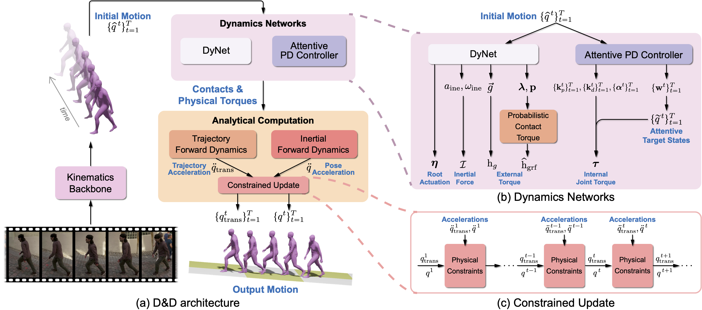

# D&D

This repo contains the code of our paper:

> [D&D: Learning Human Dynamics from Dynamic Camera]()  
> Jiefeng Li, Siyuan Bian, Chao Xu, Gang Liu, Gang Yu, Cewu Lu  
> ECCV 2022 Oral  

<!-- [[`Paper`](https://openaccess.thecvf.com/content/CVPR2021/html/Li_HybrIK_A_Hybrid_Analytical-Neural_Inverse_Kinematics_Solution_for_3D_Human_CVPR_2021_paper.html)]
[[`Supplementary Material`](https://openaccess.thecvf.com/content/CVPR2021/supplemental/Li_HybrIK_A_Hybrid_CVPR_2021_supplemental.zip)]
[[`arXiv`](https://arxiv.org/abs/2011.14672)]
[[`Project Page`](https://jeffli.site/HybrIK/)] -->

*Comming soon*

## Citing
If you find our code or paper useful, please consider citing

    @inproceedings{li2022dnd,
        title={D\&D: Learning Human Dynamics from Dynamic Camera},
        author={Li, Jiefeng and Bian, Siyuan and Xu, Chao and Liu, Gang and Yu, Gang and Lu, Cewu},
        booktitle={European Conference on Computer Vision},
        year={2022}
    }
